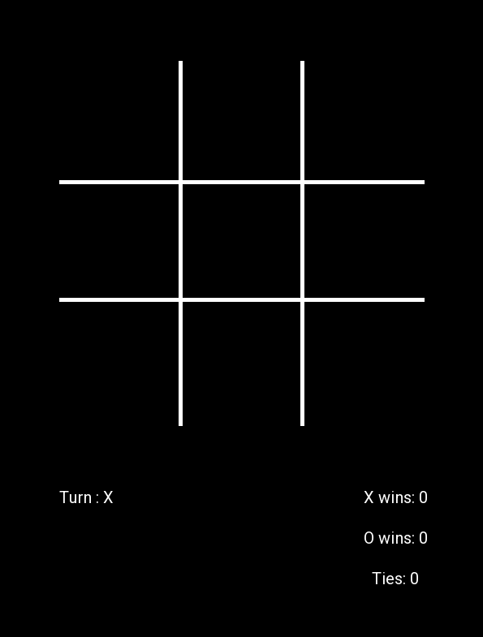
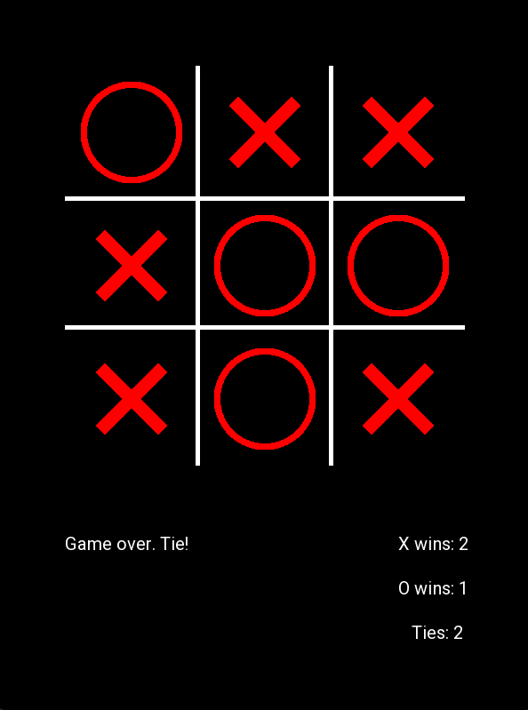
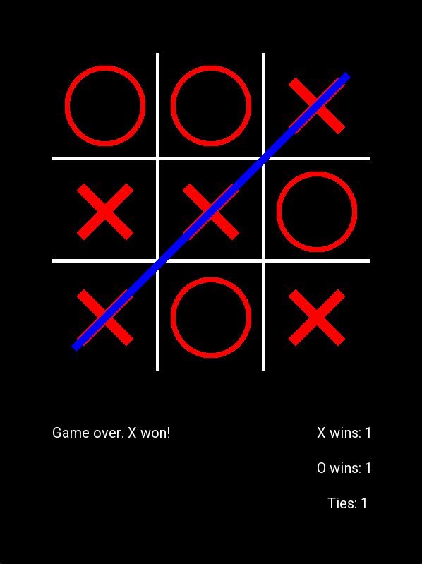

# Tic-Tac-Toe (SFML)

A simple Tic-Tac-Toe game built using SFML.

## Features
- Click-based gameplay
- Supports "X" and "O" turns
- Detects winning conditions (row, column, diagonal)
- Displays game status (turns, wins, ties)
- Reset the game with a middle mouse click
- Simple and interactive UI

## Screenshots


*The initial game screen before any moves.*


*The game over screen showing the result.*


*The game over screen showing the result is tie.*


## Controls
- **Left Click**: Place "X" or "O" in an empty cell.
- **Right Click**: Display debug information.
- **Middle Click**: Reset the game.

## How to Run
1. Make sure you have **SFML** installed.
2. Compile the project using a C++ compiler that supports SFML.
   ```sh
   g++ -o tic_tac_toe main.cpp -lsfml-graphics -lsfml-window -lsfml-system
